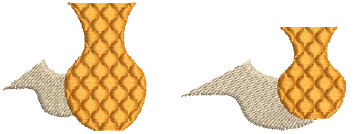

# Scaling objects

You can scale objects by dragging [selection handles](../../glossary/glossary), specifying exact dimensions in the Property bar, or by setting a distance between reference points on the design. As an object is scaled, the stitch count changes to preserve the current spacing.

Note: Only [EMB](../../glossary/glossary) designs contain the complete set of design information for 100% perfect scaling and transformation.

## Related topics...

- [Scale objects interactively](Scale_objects_interactively)
- [Scale objects numerically](Scale_objects_numerically)
- [Scale objects by reference line](Scale_objects_by_reference_line)
- [Make objects the same size](Make_objects_the_same_size)
