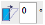
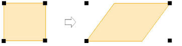
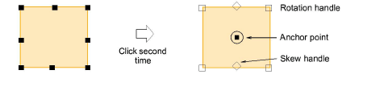
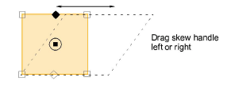

# Skewing objects

|  | Use Transform > Skew to skew selected objects by an exact amount (in degrees). |
| ---------------------------- | ------------------------------------------------------------------------------ |

You can skew objects directly on screen or by setting an exact skew angle.

## To skew objects...

1. Select the objects to skew.

2. Click the object a second time. Skew handles are diamond-shaped and appear at the center-top and bottom of the object.

3. Drag handles left or right.

Tip: Alternatively, to skew by an exact amount, enter an exact angle in the Skew field on the Transform toolbar and press Enter.
