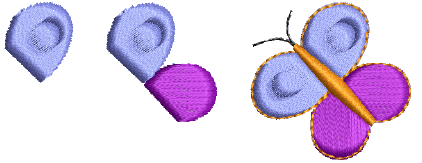

# Transforming Objects

Change position, size and orientation of objects by moving, [scaling](../../glossary/glossary#scaling) and transforming them. Modify objects directly on screen or via their [object properties](../../glossary/glossary#object-properties). Mirror objects or entire designs. Create design ‘wreathes’ or borders. Create design arrays for efficient stitchout.

::: info Note
The scalability and stitching quality of a design ultimately depend on its original source – Native Design, Imported Outlines, Processed Stitches, or Imported Stitches. Only [EMB](../../glossary/glossary) designs contain the complete set of design information required for 100% perfect scaling and transformation. [See also Embroidery file formats.](../../Basics/basics/Embroidery_file_formats)
:::

## Related topics...

- [Arranging objects](Arranging_objects)
- [Scaling objects](Scaling_objects)
- [Rotating objects](Rotating_objects)
- [Skewing objects](Skewing_objects)
- [Mirroring objects](Mirroring_objects)
