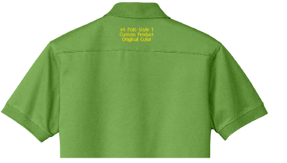
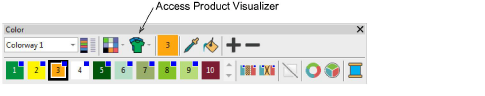
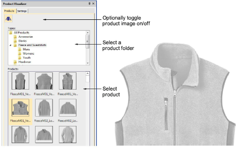
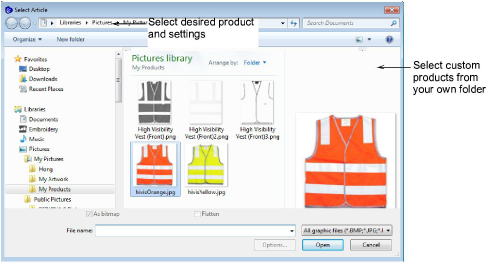
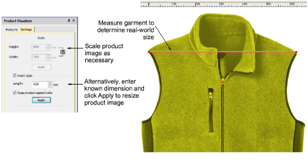

# Add your own pre-coloured or re-colourable product images

# Easier to select and use Product images

## Access Product Visualizer From Color Toolbar

- Access the improved Product Visualizer via a button on the Color toolbar. [See Visualize products for details.](../../Digitizing/colorways/Visualize_products)

## Select Desired Product and Setting from new Docker

- Standard generic products are organized in folders by product type

## Select custom products from your folder of product images

## Re-color and Re-size Product Articles in the Settings tab

- Re-size a product graphically or use Smart Tape to use a specific a measurement
- Re-size a product by specifying the size in mm (rather than %)
- Re-size a product using Smart Tape to use a specific a measurement.

[See Visualize products for details.](../../Digitizing/colorways/Visualize_products)

## Product Images are copied and saved in the actual design EMB file

- The product image goes with the design to anyone you send the EMB file to
- Unlike e3 EMB which only kept a reference to the product image filename.
