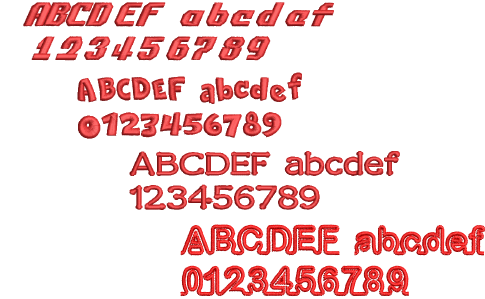

# Additional lettering fonts of various styles

EmbroideryStudio e4 includes 32 new professionally digitized fonts, including:

- Mixture of normal embroidery fonts
- 3D foam fonts
- More and better running stitch fonts
- Outline fonts for sports lettering
- Two-color outline fonts
- Commercial logo fonts
- Double-color bordered fonts used for sports apparel and by hobbyists. [See also Standard Fonts.](../../Management/sample_fonts/Standard_Fonts)

