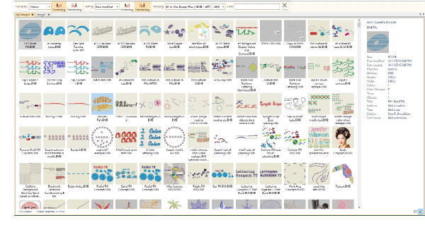
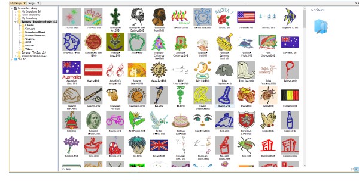
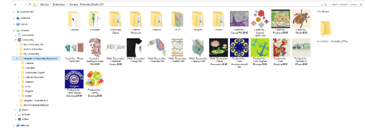

# Design Library can show all designs in all folders

- Browse embroidery designs from all folders and sub-folders at the same time. Windows Explorer can only show designs in one folder at a time.
- Sort designs by date to see your most recent designs at the top, even if you can’t remember what folder you put it in.

## For your entire embroidery library... e.g. sorted by date descending

## … or a Selected Portion of your Library… e.g. sorted by filename ascending

## Windows Explorer shows only one folder at a time

