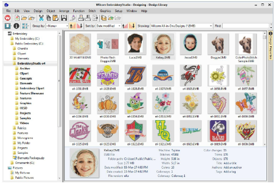

# Design Library operates within the main ES window

- Easily switch between open design window and the Design Library
- Library commands are in a toolbar at the top of screen
- Double-click to open a design for editing.
