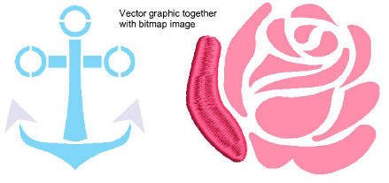

# Dim graphics

|  | Use View > Show Graphics as Dimmed to dim graphic backdrops to show stitches more clearly for digitizing. |
| ---------------------------------------- | --------------------------------------------------------------------------------------------------------- |

Click the new Show Graphics as Dimmed button to dim the onscreen image to view stitches more clearly when digitizing. The command applies both to bitmap and vector graphics.

