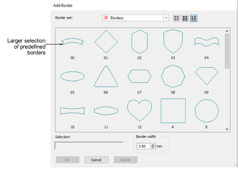

# Improved Add Border

|  | Use Toolbox > Add Borders to add borders to designs (or selected objects) with or without lettering. |
| -------------------------------------- | ---------------------------------------------------------------------------------------------------- |

The Add Borders tool provides a greater selection of predefined border shapes. These are also available via the Graphics Digitizing toolbar as a Basic Shapes gallery. [See Add design borders for details.](../../Modifying/productivity/Add_design_borders)

