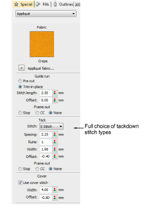

# Improved Auto Appliqué

EmbroideryStudio e4 includes the following improvements to auto appliqué:

- Full choice of cover stitches, including no cover stitch.
- Full choice of tackdown stitch types with parameters.

Note: Cover stitch is generally a satin border around the appliqué shape. For more or less dense cover stitching, you can now change stitch types via the Object Properties > Fill tab. [See Creating appliqué embroidery for details.](../../Applied/applique/Creating_appliqué_embroidery)
