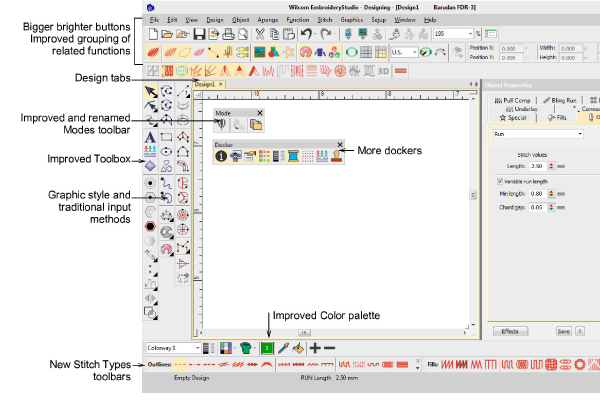
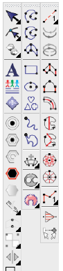
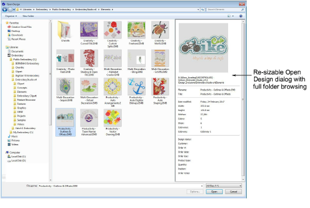
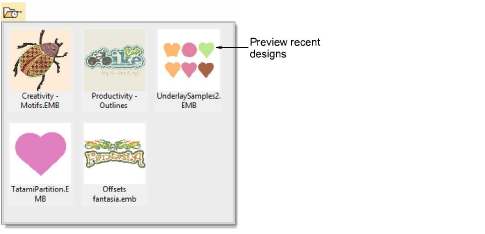
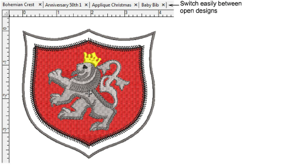
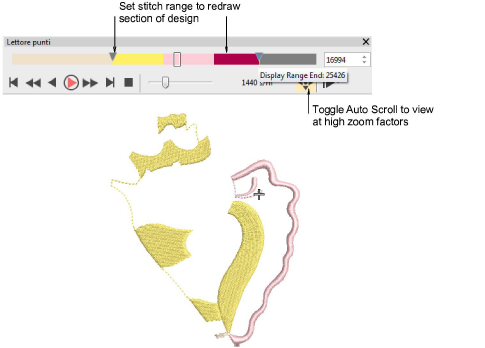

# Improved ES design workspace

The EmbroideryStudio e4 user interface uses the same basic style and layout as e3 with some improvements. Not a big learning curve for existing customers to upgrade. EmbroideryStudio e4 introduces a new easier ‘graphics style’ of embroidery digitizing while also improving on the professional ‘traditional’ digitizing style. Graphics style is standard in ES Decorating while both graphics and traditional digitizing are standard in ES Designing and ES Digitizing.

The user interface now includes:

- New color scheme
- Selectable icon size with or without icon labels
- 4K high resolution monitor support
- an improved General toolbar at the left
- a new Graphics Digitizing toolbar
- an improved Traditional Digitizing toolbar
- a new Outline Stitch Types toolbar
- an improved Fill Stitch Types toolbar
- an improved Stitch Effects toolbar
- a new My Threads docker
- an improved Color toolbar

## Improved toolbox organization

The main vertical toolbox at the left side of the screen is re-organized for more efficient and obvious use:

- A simplified main toolbox has the commonly used tools for all product models.
- A new vertical Graphics Digitizing Tools toolbar holds graphics style shape tools.
- A new vertical Traditional Digitizing Tools toolbar holds improved traditional digitizing tools.

All frequently used tools are available in a single click – not hidden in flyout toolbars.

Note: Some optional features are shown. Not all tools are in all product models.

## Improved flyout toolbars

Infrequently used tools are combined into flyout toolbars to save screen space and visual distractions. All flyouts can still be detached and left open if desired. Flyout toolbars are also quicker to respond and hence easier to use.

## Improved default layout of tools and toolbars

Default layout of tools and toolbars in EmbroideryStudio e4 has been updated as follows:

- Only commonly used toolbars visible by default – specialty toolbars deactivated.
- Improved grouping of toolbars based on common usage.
- Vertical toolbox flyouts replaced with expanded toolbars for easier access.

## Large Open and Save dialogs

EmbroideryStudio implements improved Open Design and Save Design dialogs.

Key features:

- Large, re-sizable Open Design dialog with full folder browsing.
- Windows Explorer search capability within the dialog.
- More extensive design preview info panel like Windows Explorer.
- Design thumbnails and preview ranging from small to extra large.

## Open recent files by thumbnails

You can now preview recent designs before opening.

## Display multiple open designs in separate design tabs

EmbroideryStudio makes it easy to see and switch between open designs with new design tabs. This also makes it easy to copy/paste between designs, including drag and drop operations. Optionally, you can tile multiple design tabs. [See also Set up multiple views.](../../Basics/view/Set_up_multiple_views)

## New Stitch Player replaces Slow Redraw

EmbroideryStudio provides an improved Stitch Player tool for handling stitchout simulations. [See also Simulate design stitchouts.](../../Basics/view/Simulate_design_stitchouts)

Key features:

- Typical ‘media player’ buttons for play, pause, rewind operations
- Progress bar showing thread colors in proportion to number of stitches
- Progress bar marker which can be dragged forward or backward
- Auto scrolling at high zoom
- No change to current needle position in the design.
