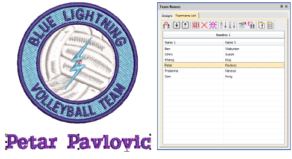

# Improved Team Names feature

|  | Use Toolbox > Team Names to associate multiple names with a design. |
| -------------------------------------- | ------------------------------------------------------------------- |

Various aspects of the Team Names feature have been improved:

- Simple teamname lettering can be managed from a single docker. [See also Creating simple teamname designs.](../../Lettering/lettering_names/Creating_simple_teamname_designs)

- Import and export lists of names from TXT or CSV file. [See also Managing teams.](../../Lettering/lettering_names/Managing_teams)

- For Advanced Team Names users, the mechanism for creating and employing single- or multi-baseline layouts, is now much easier via the dedicated Team Names > Designs tab. [See also Teamname templates.](../../Lettering/lettering_names/Teamname_templates)

::: info Note
By default, the Designs tab includes a ‘Custom’ folder which is the default for all user-defined teamname templates. If you merge settings from an older version of the software, other folders may appear.
:::

- Re-purpose designs for use as custom layouts via the File > Save as Teamname Template command.
