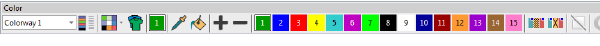

# Improved color palette

The Color Palette has been improved and extended with new features. It now defaults to 15 colors representing 15 needles on a machine. Use the new My Threads docker to change the RGB values or assign real thread colors. [See also Choosing threads.](../../Basics/threads/Choosing_threads)

There are new tools to manage colors in the design palette more easily:

| Tool                                  |     | Details                                                                                              |
| ------------------------------------- | --- | ---------------------------------------------------------------------------------------------------- |
| My Threads                            |     | Invokes the new My Threads docker.                                                                   |
| Hide Unused Colors                    |     | Displays only colors used by the design.                                                             |
| Remove Unused Colors                  |     | Replaces Compact Palette to remove all colors not used in the design. It then renumbers used colors. |
| Split Palette                         |     | The existing command remains.                                                                        |
| Current Color                         |     | Highlight which palette color is current.                                                            |
| Pick Color                            |     | Eye dropper to select a new color from the design and make current.                                  |
| Apply Current Color                   |     | Re-color objects in the design with the current color.                                               |
| Cycle Colors                          | ^   | Automatically re-color objects by swapping colors used in the design.                                |
| Color Wheel                           | ^   | Create new color combinations based on rotating existing colors through the color space.             |
| ^ ES Designing and ES Digitizing only |     |                                                                                                      |

Other features:

- Color palette positions are numbered for easier reference
- Used colors are tagged with a blue marker.
