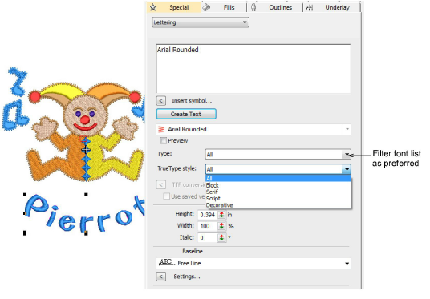

# Improved font selection user interface

|  | Use Toolbox > Lettering to create embroidery lettering directly on-screen. Right-click to access settings. |
| -------------------------------------- | ---------------------------------------------------------------------------------------------------------- |

EmbroideryStudio e4 includes improvements in font selection. Fonts are listed in category groups for easier identification. This makes it easier to find a suitable font for a particular purpose in mind. Also you can type the font name to select it from the list. The first few letters of the name will locate it in the list. [See also Creating embroidery lettering.](../../Lettering/lettering_create/Creating_embroidery_lettering1)

Fonts are grouped as follows:

| Category     | Details                                                                |
| ------------ | ---------------------------------------------------------------------- |
| Type         | Embroidery font, TrueType font (TT), OpenType font (OT)                |
| Style        | Block, serif, script, decorative, etc                                  |
| Technique    | Normal, Run stitch, 3D Foam, Chenille, Border, Monogram, appliqué, etc |
| User-defined | Custom font vs system font.                                            |
