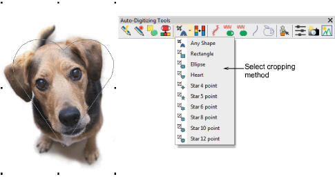

# Improved image preparation

|        | Use Auto-Digitize > Crop Bitmap to crop bitmap artwork for use with auto-digitizing. |
| -------------------------------------------- | ------------------------------------------------------------------------------------ |
|  | Use Auto-Digitizing > Adjust Bitmap to adjust image lightness and contrast.          |

EmbroideryStudio provides ready access to cropping and touch up functions. The functions are still available from the Graphics menu but can now be readily accessed from the Auto-Digitize toolbox. The Crop Background tool opens a new Crop toolbar which in turn provides ready access to all cropping functions. [See also Preparing artwork for digitizing.](../../Automatic/bitmaps/Preparing_artwork_for_digitizing)

The new Adjust Bitmap function allows you to adjust image lightness and contrast, primarily for use with the new Color PhotoStitch tool. See below.
