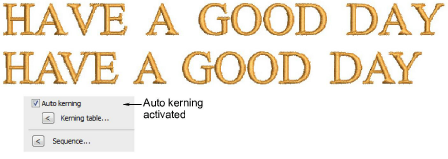

# Kerning tables for more fonts

Spacing kerning tables are now included for all fonts. Kerning is also the default spacing method. Kerning automatically adjusts spacing between pairs or triplets of letters. This can improve readability and appearance. Unlike character spacing, kerning is defined in the actual font. [See also Setting automatic letter kerning.](../../Lettering/lettering_advanced/Setting_automatic_letter_kerning)

