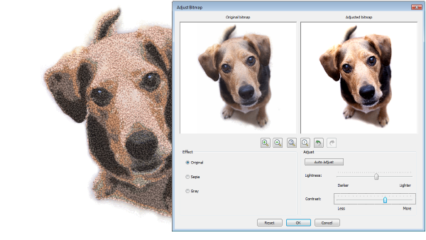

# New Color PhotoStitch

|  | Use Auto-Digitizing > Color PhotoStitch to automatically turn photographs and other bitmap artwork into multi-colored embroidery. |
| ---------------------------------------------------- | --------------------------------------------------------------------------------------------------------------------------------- |

Amongst new and improved auto-digitizing features, EmbroideryStudio provides a powerful new Color PhotoStitch tool. [See also Auto-digitize with Color PhotoStitch.](../../Automatic/automatic/Auto-digitize_with_Color_PhotoStitch)

Process...

- Import a photo/picture.
- Optionally, crop the image.
- Optionally cut out/mask background from the foreground with the cropping functions. You can do additional passes of the same photo with different cropped areas.
- Optionally adjust lightness and contrast in the image.
- Set the number of thread colors to use.
- Map image colors to a selected thread chart.
- Optionally, adjust stitching resolution to high, medium, or low. High resolution allows greater detail but with a higher stitch count.
- Automatically convert to stitching using multiple thread colors.
- Optionally, edit the resulting embroidery objects. Stitching created by Color PhotoStitch is editable as individual Manual Stitch objects. Select and delete as preferred and/or digitize other objects over the top.
