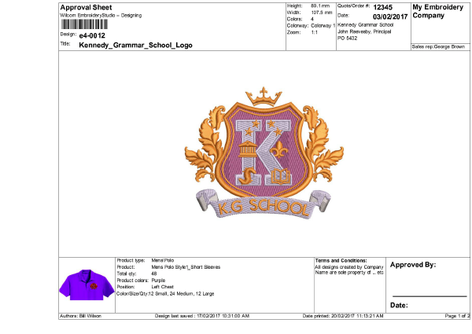
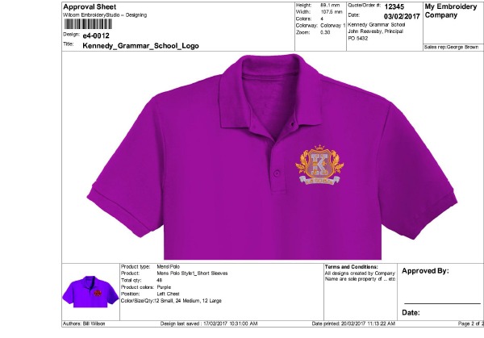
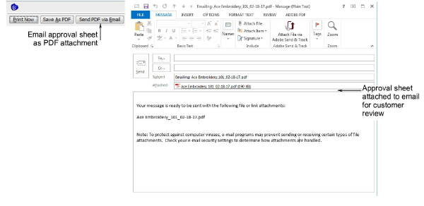
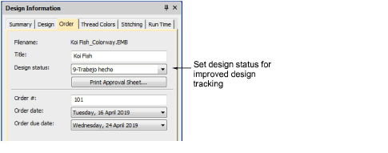
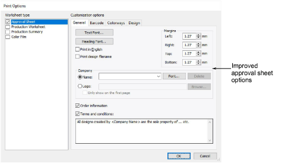

# New Improved Design Approval Process

EmbroideryStudio introduces a much improved design and order approval sheet and process:

- Improved Approval print form displays main Order and Job details

3Uses Improved Product Visualizer images

3Includes Customer, Order, and other job details

3Excludes stitch count for commercial confidentiality

3Various improvements to the Print Options dialog

- Email PDF print file to customer for quote / approval

3with automatic PDF filename

3Print to PDF file on local network for easy staff reference

- Track approval status via ‘Design Status’ field in EMB file / Design Library

## Improved Approval Print Forms with Job Order Details

Relevant order / job details previously saved in the EMB file are displayed on the design Approval Sheet.

- Design close up / actual size on page 1

- Design on selected Product Image visualized on page 2

The changed information added to the Approval form in EmbroideryStudio includes:

- Customer, Customer Contact, Customer Reference
- Order Date, Sales Rep
- Product Type, Product Name, Product Color(s), Embroidery Position
- Total Quantity, Quantity by Color and Size
- Terms and Conditions text
- Signature Block for name and date approved
- Stitch count removed

## Email PDF of Approval Sheet to customer for approval

- Send approval forms via PDF to customer for approval.
- Add pricing and delivery details in covering email – not saved in EMB file
- Optionally Save PDF prints to local disk or network drive for staff access
- Optionally email and save PDF of Production Worksheet prints for production use

## Track Status of Design Approval via Status field in EMB File

If desired, you can set/update the design status field in the Design Information docker. Then other staff can see and monitor the design approval status via Design Library.

## Improved Print Options Dialog

Various improvements are made to the Print Options dialog to support improved Approval Sheet.

