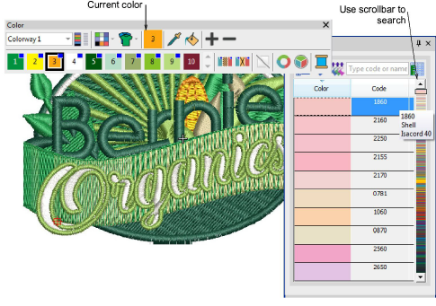
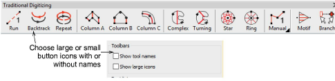
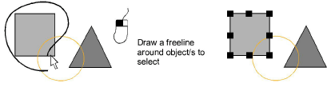
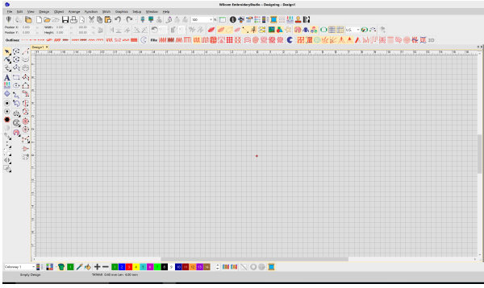
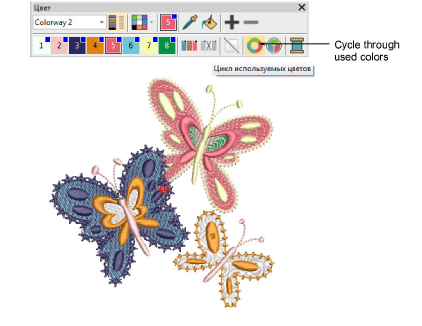
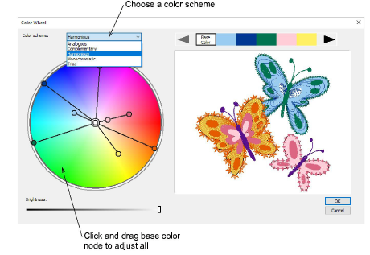

# New My Threads docker

A new ‘My Threads’ docker makes it easy to select and assign thread colors. [See also Assign thread colors.](../../Basics/threads/Assign_thread_colors)

Key features:

- Easily choose which thread charts to display.
- Dynamically sort thread colors in docker by numerical code or color shade.
- Locate desired colors using a color scroll.
- Enter color code to locate a specific color.
- Double-click to assign thread color to current palette slot.

## Configurable toolbar display

|  | Use Standard > Options to access application options for design view, grid & guides, and other settings. |
| ---------------------------------- | -------------------------------------------------------------------------------------------------------- |

EmbroideryStudio allows you the choice of large or small button icons with or without short names. [See Toolbar display options for details.](../../Setup/settings/Toolbar_display_options)

## Object selection

|      | Use Toolbox > Select Tools > Select Object to select individual objects as well as groups or ranges of objects. |
| ------------------------------------------------ | --------------------------------------------------------------------------------------------------------------- |
|  | Use Toolbox > Select Tools > Freehand Select to select object at current by drawing a freehand line.            |

In addition to existing Select tools, the new Freehand Select tool allows you to draw a freeline around the object/s you want to select.

## Support for 4K high-res monitors

EmbroideryStudio e4 now provides support for 4K high resolution monitors. Buttons are large enough to be seen effectively providing effective use of the large graphic area.

## Quick recoloring

New tools allow you to quickly re-color entire designs. [See also Add colorways.](../../Digitizing/colorways/Add_colorways)

- The Cycle Colors tool lets you automatically re-color objects by swapping colors used in the design.

- Use the Color Wheel to cycle through different color combinations using preset color schemes – Analogous, Complementary, Harmonious, etc.

