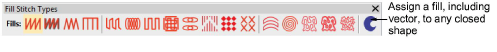

# New graphics digitizing style

The graphics approach to digitizing operates similar to graphics design programs. It provides one set of tools to create shapes to be stitched:

- on the shape as outlines, or
- inside the shape as fills, or
- both

Assign an outline or a fill to a shape by clicking on the desired stitch type in the new Stitch Types toolbar.

To create both an outline and a fill, create the fill first, then select and duplicate the object and convert the duplicate to an outline, which is stitched after the fill.

Standard in ES Designing, ES Digitizing, and ES Decorating products.

## New graphics digitizing tools for both outlines and fills

The new Graphics Digitizing Tools toolbar provides one easy set of tools for digitizing shapes for either fills or outlines.

Standard graphics digitizing tools in ES Decorating include:

- Digitize Open Shape, Digitize Closed Shape, Digitize Columns (Column A),
- Rectangle (Square), Ellipse (Circle), Single Line

Additional graphics tools in ES Designing and ES Digitizing include:

- New Basic Shapes tool
- Freehand Open Shape, and Freehand Closed shape with the Freehand optional element.

Assign an outline stitch type to open or closed shapes created from any shape tools by clicking on the desired outline type in the new Stitch Types toolbar. Assign a fill stitch type to closed shapes in the same way.

## New Stitch Types toolbar

Assign an outline stitch type to open or closed shapes created from any shape tools by clicking on the desired outline type in the new Outline Stitch Types toolbar.

ES Decorating includes 6 standard outline stitch types:

- Run stitch, Triple run, Satin stitch, Zigzag stitch, E Stitch, Vector Outline

ES Designing and ES Digitizing include 12 standard outline stitch types:

- The 6 outline stitches in ES Decorating, plus 6 more
- Backstitch, Stemstitch, Tatami outlines
- New Sculpture stitch, new Satin Raised stitch, and new Square stitch.

Satin, Zigzag, and E Stitch outlines automatically create a thick outline along the shape using the Column C object type. Use the rectangle and circle tools for outlines as well as for fills.

Assign a fill stitch type to a closed shape created from any shape tools by clicking on the desired fill type in the new Fill Stitch Types toolbar.

ES Decorating includes 6 standard fill types: Satin stitch, Zigzag stitch, E Stitch, Tatami, Motif Fill, Vector Fill.

Standard motif fill is a simplified motif fill for predefined motifs only, as in DecoStudio e3. Fully featured motif fill capabilities are provided as an add-on element for ES Designing and ES Digitizing only.

ES Designing and ES Digitizing include 10 standard fill types:

- The 6 fill stitches in ES Decorating, plus 4 more:
- New Satin Raised, new Square stitch, new Double Square, Program Splits

ES Designing and ES Digitizing offer a further 7 optional fill stitch types via various optional elements:

- New Satin Flexi Split, Cross Stitch, Contour, new Spiral
- Stipple run, Stipple Backstitch, Stipple Stemstitch.

## No prompts for additional input with graphics style tools

Graphics digitizing tools do not prompt for additional input such as multiple boundaries (holes) or stitch angles. These are automatically set to sensible default values. If you want to change them, use the new hole tools, stitch angle tools, and reshape tool to adjust. This approach has the advantages of:

- Immediate stitching result after creating the shape
- Easier and more obvious especially for newcomers
- More capabilities with fewer tools.

## New add or remove stitch angles and holes to fills

Filled objects default to straight parallel stitching (complex fill) at your preferred default stitch angle value.

- Change a parallel fill to turning fill with the Add Stitch Angle tool.
- Change a turning fill to a parallel fill with the Remove Stitch Angles tool.
- Use Reshape to adjust existing stitch angles in an object.

Filled objects default to a single boundary, no holes.

- Add holes to a filled object using Add Hole tool
- Remove all holes from a filled object with Remove Holes, or
- Fill all holes in a filled object with Fill Holes.

[See also Adding & filling holes.](../../Modifying/productivity/Adding_filling_holes)

## New vector drawing standard with graphic digitizing tools

Use the same graphic digitizing tools to create shapes for vector objects (no stitching).

- Select Vector Outline from the Outline Types toolbar, or
- Select Vector Fill from the Fill Types toolbar
- Use Object Properties to set both Outline and Fill properties for the same object.

Vector drawing is standard in e4 ES Decorating, ES Designing and ES Digitizing, not optional as in e3\. [See also Creating vector shapes in EmbroideryStudio.](../../Automatic/vectors/Creating_vector_shapes_in_EmbroideryStudio)
