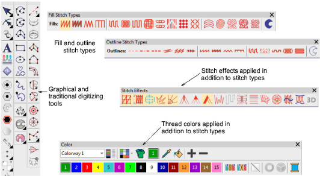
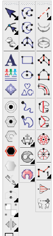

# New graphics style plus traditional digitizing

EmbroideryStudio e4 has a new outline/fill digitizing paradigm similar to graphics applications. This should make digitizing easier and more obvious for beginners, and much easier to convert between outlines and fills generally. But don’t worry, the new paradigm does not compromise the ability of professional digitizers to do the same ‘power digitizing’ they do now. If anything, digitizing should become that much easier. [See also Digitizing Shapes.](../../Digitizing/input/Digitizing_Shapes)

::: info Note
Some optional features are shown. Not all tools are in all product models.
:::

## New digitizing user interface

The user interface now includes:

- an improved General Toolbox vertical toolbar at the left
- a new Graphics Digitizing Tools vertical toolbar
- an improved Traditional Digitizing Tools vertical toolbar
- a new combined outlines and fills Stitch Types toolbar
- an improved Stitch Effects horizontal toolbar

Everyone appreciates:

- how much easier and obvious it is to digitize designs
- the many new combinations of any shape with any stitch type
- ability to convert virtually any fill to any outline and vice versa with a single click.

Production digitizers appreciate:

- additional capabilities and control with traditional digitizing,
- higher digitizing productivity,
- flexibility that both approaches provide
