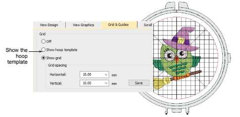

# New hoop template

|  | Click View > Show Grid to show or hide the grid. Right-click for settings. |
| ------------------------------------ | -------------------------------------------------------------------------- |

Now you can optionally turn on the Hoop Template display via the Options dialog or View menu. The template may be used to help position your design within the hoop.

::: tip
You can include the hoop template in the production worksheet, together with alignment and registration guide markings. This allows you to cut out the printed design and align it within the hoop. Use the template markings to align it to physical hoop template.
:::
