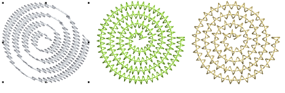

# New & improved creative stitching

EmbroideryStudio e4 brings the following improvements in creative stitching for ES Designing and ES Digitizing.

## Spiral fill

Spiral Fill is a new add-on Element available in ES Designing and ES Digitizing only. It works best with simple shapes that can be stitched in a single segment without holes or islands. Use it with either fixed or variable length run stitching. With longer shapes, it may generate stitches that go outside the perimeter of the object, but this can provide for some interesting visual effects.

Different stitch types can be used – sculpture, backstitch, stemstitch, or run stitch. Similarly, basic spiral fills can be converted to outlines such as motif run, satin outline, sequin run, and bling run. [See also Spiral fills.](../../Decorative/curves/Spiral_fills)

## Radial fill

|        | Use Stitch Effects > Radial Fill to create radial turning stitching with available stitch types. |
| ---------------------------------------------- | ------------------------------------------------------------------------------------------------ |
|  | Click Reshape > Reshape Object to view the reshape nodes of a selected object.                   |

New Radial Fill creates radial turning stitching in either Satin or Tatami objects. Stitches are generated from the outside edge to the geometric center. The center can be shifted. The effect may be on or off while digitizing. Shaping operations such as Mirror Merge or Remove Overlaps preserve the effect. [See also Radial fills.](../../Decorative/curves/Radial_fills)

## Zigzag outlines

|  | Use Outline Stitch Types > Zigzag run for narrow, open borders with a ‘zigzag’ effect. |
| ---------------------------------------------- | -------------------------------------------------------------------------------------- |

New zigzag outline stitch creates V-shape stitching whereas satin outline creates N-shape stitches. [See also Decorative borders.](../../Decorative/specialty/Decorative_borders)

Features:

- Zigzag stitch spacing and width independent of satin parameters
- Works with automatic corner processing.
