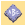
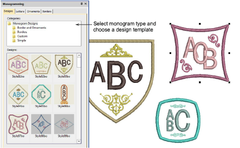
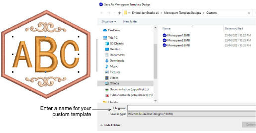
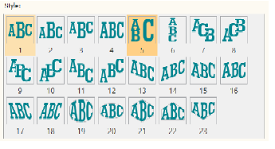
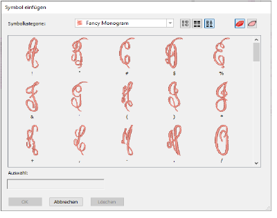

# New & improved monogramming

|  | Use Toolbox > Monogramming to create personalized monograms using a selection of predefined monogramming styles, border shapes and ornaments. |
| -------------------------------------------- | --------------------------------------------------------------------------------------------------------------------------------------------- |

You build monograms using the Monogramming docker. The simplest way to get started is with the new Designs tab. This gives you a selection of design templates ranging from lettering only, with borders, or with ornaments. The updated Monogramming docker also includes:

- 38 border shapes with many different stitch types
- More predefined styles including enveloped styles
- Increase to 8 border shapes and also with many different stitch types. [See also Monogramming.](../../Lettering/lettering_monograms/Monogramming)

## Monogram templates

EmbroideryStudio e4 also includes predefined monogram templates typical for commercial use. These contain layouts commonly used for typical items such as shirt pockets, cuffs, towels, and other popular items. If you want to save a design as a template for future use, use the new File > Save as Monogram Template command. The design will appear in the Designs tab under the Custom folder.

## More styles

The Monogramming docker also includes more predefined styles including enveloped styles.

## Easier use of borders and flourishes in monogram fonts

You can now select monogram ornaments from alphabet fonts. The size of ornament is set independently of the letters.

## Greater control

You now have greater control of more advanced settings in monogramming styles. For example:

- Control of the size ratio of letters in styles. This replaces separate letter height parameters.
- Control of letter spacing for all styles.
- Option to remove underlying stitching where letters overlap.
