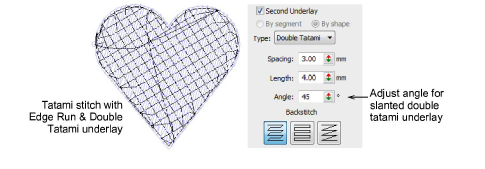
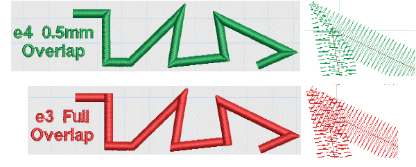
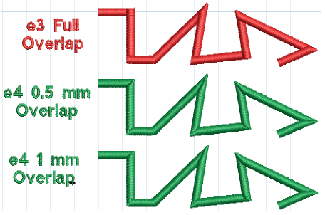
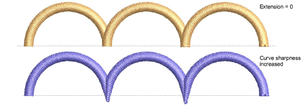
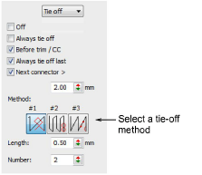

# New & improved technical stitching

EmbroideryStudio e4 brings the following improvements in technical stitching for ES Designing and ES Digitizing.

## New & improved automatic underlay

EmbroideryStudio e4 brings important improvements in automatic underlay.

- Default tatami underlay stitch angles: 90° to top stitch when single layer tatami. 45° when using a double layer tatami (net fill).
- For extra support with very soft or elastic fabrics, try using Double Tatami in combination with Edge Run. Adjust stitch angle so that Double Tatami provides symmetrical slanting in forward and backward directions. This should result in a ‘cross-hatch’ effect. In addition, it can give a raised surface similar to ‘puff embroidery’.

- When Auto Fabric is turned on, a default underlay is applied, based on fabric settings. When Auto Fabric is turned off, an underlay is still appled but it is based on the digitizing method. Previously, with Auto Fabric turned off, underlay was not applied to newly digitized objects. [See Stabilizing with automatic underlay for details.](../../Quality/underlays/Stabilizing_with_automatic_underlay)

## Improved quality of Lap corners

|  | Use Stitch Effects > Lap Corners for ‘Tidori’ style stitching. Right-click to adjust settings. |
| ---------------------------------------- | ---------------------------------------------------------------------------------------------- |

Lap overlaps for satin stitching have been reduced for a better appearance and less chance of poking out. This saves time on manual editing or re-digitizing. The Lap Corners feature has been significantly extended and improved in ES e4\. It provides better technical stitching as well as new creative stitching effects. Together these make the feature more usable in more cases, helping reduce manual digitizing times. The main changes are:

- Choice of full overlap or split overlap methods, object-by-object.
- Improved ‘Full Overlap’ method – flat curve intersections
- New ‘Split Overlap’ method with:

3Variable amount of overlap at the corner

3Sharper corner geometry for curved shapes.

## Lap Corner Split Overlaps

The new ‘Split Overlap’ method provides a selectable amount of overlap between the two parts of a lapped corner. This is similar to a mitre corner, but with different stitching. [See Controlling corner stitching for details.](../../Quality/quality/Controlling_corner_stitching)

Variable amount of overlap in lapped corners is possible.

## Improved Lap Corner Curve Extensions

The existing e3 Lap Corners method continues to provide a ‘full overlap’ of segments at a corner. A new ‘flat corner’ effect for digitizing curved scallop shapes is now possible. Curve shapes can have flat full or selectable pointed split overlaps. [See Controlling corner stitching for details.](../../Quality/quality/Controlling_corner_stitching)

## Improved tie-off stitching

Tie-offs with satin stitching can cause problems in some cases such as:

- Becoming visible in the stitchout
- Coming undone
- Sticking out beyond the shape.

The software includes a new tie-off method. Existing methods remain in place as well. The new #3 method splits the second-last stitching line into three equal stitches. It also adds a specified number of small stitches between the last two stitching lines. It is generally used with dense fills. [See Automatic tie-off settings for details.](../../Quality/connectors/Automatic_tie-off_settings)

