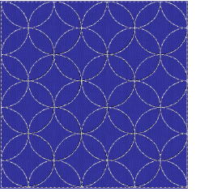
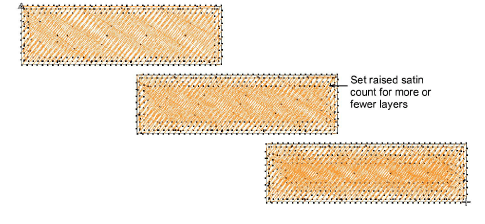
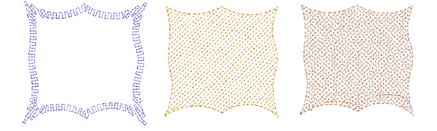

# New standard stitch types

EmbroideryStudio e4 provides four new standard stitch types in ES Designing and ES Digitizing.

## New Sculpture Outline stitch

|  | Use Outline Stitch Types > Sculpture Outline to create a thick-thin outline alternating single and triple stitches for a hand-stitched look. |
| ------------------------------------------------------ | -------------------------------------------------------------------------------------------------------------------------------------------- |

For a more hand-stitched appearance, use the new Sculpture Outline. This variant stitch type alternates single and triple stitching for a thick-thin outline. Alternating single and triple straight running stitches, gives a hand stitched look. [See also Simple outlines.](../../Digitizing/stitches/Simple_outlines)

## New Satin Raised stitch

|  | Use Fill Stitch Types > Satin Raised to create raised surfaces – can be applied to lettering or used with trapunto for quilting effects. Right-click for settings. |
| -------------------------------------------------- | ------------------------------------------------------------------------------------------------------------------------------------------------------------------ |

- Automatic multiple layers of overlapping satin stitching for a 3D look
- For both fills and outlines (Column C)

[See also Satin stitching.](../../Digitizing/stitches/Satin_stitching)

## New Square stitch

|            | Use Outline Stitch Types > Square to create open borders or columns of even width for an open ‘toothed’ effect. Right-click for settings. |
| ------------------------------------------ | ----------------------------------------------------------------------------------------------------------------------------------------- |
|  | Use Fill Stitch Types > Square to create open straight parallel fills. Right-click for settings.                                          |

- Square end open run style fill
- For both fills and outlines
- Useful for digitizing underlays as an object on their own for special cases. [See also Chenille patterns.](../../Decorative/specialty/Chenille_patterns)

## New Double Square stitch

|  | Use Fill Stitch Types > Double Square to create grid fills. Apply closed shapes. |
| -------------------------------------------- | -------------------------------------------------------------------------------- |

- Two layers of square end open run style fill
- At a selected angle to each other - default 90 degrees
- Useful for digitizing underlays as an object on their own for special cases.

## Basic Motif fill Standard

|  | Use Fill Stitch Types > Motif Fill to create decorative fills using embroidery motifs to form repeating patterns. Right-click for settings. |
| -------------------------------------- | ------------------------------------------------------------------------------------------------------------------------------------------- |

- In ES Decorating/Designing/Digitizing
- Additional predefined motifs included

Standard motif fill is a simplified motif fill for predefined motifs only, as in DecoStudio e3. Fully featured motif fill capabilities are provided as an add-on element for ES Designing and ES Digitizing only. [See also Motif stitching.](../../Digitizing/stitches/Motif_stitching)
