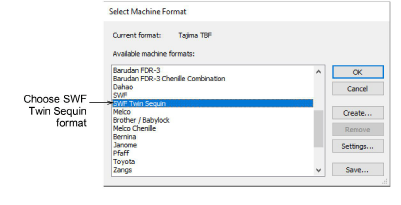
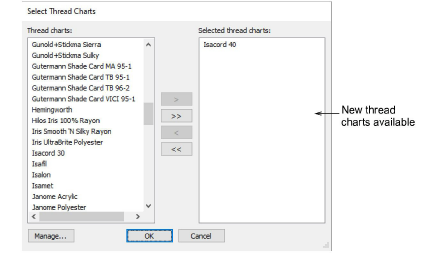

# Other improvements

EmbroideryStudio e4 provides the following additional improvements.

## Machine formats

EmbroideryStudio now provides support for SWF Twin Sequin machine format.

## Improved speed of very large designs

Especially sequin designs

## Wider range of embroidery machine hoops

## Updated threads charts

The following thread charts have been added to EmbroideryStudio:

- Iris UltraBrite Polyester
- Iris Smooth ’N Silky Rayon
- Madeira Frosted Matt 40
- Timeless

## Improved file support

EmbroideryStudio e4 reads and writes a new EMB4 file format. Features include:

- Reads all previous versions of EMB file, including EMB 3.5 from Janome 5, Hatch 1.
- Writes the four most recent versions of EMB file e4, e3.5, e3, e2.
- Reads all versions of ART file, including new ART8, but does not write ART format.
- Reads all versions of JAN and writes to JANV4.

## Printing directly to PDF

You can now print directly to PDF without need for third-party software. This allows you to save Design Approval sheets, Production Worksheets, and Virtual Decoration PDFs to predefined filenames and locations.
