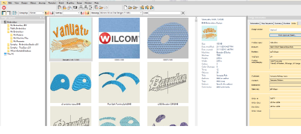
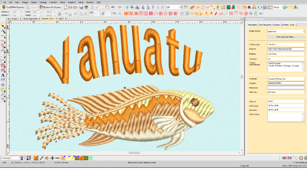
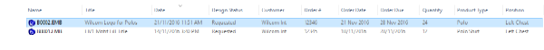

# Use the EMB Job Order Details to Prepare and Track Jobs

Embroidery sales and customer service staff can prepare and manage quotations and orders:

- create new design requests and enter job Order details in new or existing designs
- determine stitch estimates to help determine pricing for quotations
- display the artwork or digitized design on the product to be embroidered
- email Approval Sheets for design and quotation for an order/job to customers for approval
- track the status of designs and customer approvals
- release approved jobs for digitizing and/or production

Digitizing managers and staff can plan and manage digitizing designs:

- know what new designs to create or existing designs to modify by customer, order, date
- track and manage the internal checking status of newly digitized or modified designs
- track and manage previous and new designs by customer, order, date and other job details

Production managers and staff can plan and manage production jobs:

- know when a new design / order is approved for production
- know what design to use for what order, and how many pieces to embroider on what products in what position, with color/size/ quantity details
- help plan production schedules from the order due date, design statistics, and job quantities

## Manage Job Order details by EMB Design

- Staff enter basic job Order details and status into EmbroideryStudio and save it in an EMB design file

3either a new EMB file which serves as a design request to be digitized

3or an already digitized EMB design which is to be used for a new order

- Design Library automatically indexes the designs with order and design details
- Staff use Design Library to view and manage designs and the orders/jobs they define

3browse, list, or search for designs by various criteria

3for customer, order, date, size, design name or description, etc

- Order / Job details are printed on Design Approval Sheets for customer approval

3With easy emailing to customers for approval

- Order / Job Details are printed on Production Worksheets for production staff

3With print to PDF to use for design work orders

- Staff use the design status to track and manage the workflow of a design or production job

3eg List designs to be digitized

3eg List designs waiting for customer approval

3eg list designs ready for production, etc

## See Job Order Details in Design Library

## See and Edit Order Details Before or After Design is Digitized

## List Designs with Order Details

Use Design Library to Group/Sort designs by Order number to see them together.

## Basic Job Order Details Stored in EMB File Properties

The order / Job details can be entered via the Design Library or the Design Properties dialog inside EmbroideryStudio. Basic order details are stored as EMB file properties. Any alphanumeric information can be entered. Fields include:

| Field                | Details                                                                                                                                                                           |
| -------------------- | --------------------------------------------------------------------------------------------------------------------------------------------------------------------------------- |
| Filename             | File name of the selected design. This will often be a number or alphanumeric format for easy cataloging.                                                                         |
| Title                | Defaults to filename. Add a more descriptive name for easy searching. This name appears on the approval sheet or worksheet.                                                       |
| Design status        | Use ‘design status’ for digitizing and approvals. Most companies will want to define their own status types – e.g. ‘Logged’, ‘Verified’, ‘In Progress’, ‘For Review’, ‘Approved’. |
| Print approval sheet | Takes you to Approval Sheet print preview directly. You have the option of sending to a printer, printing a PDF, or sending by email.                                             |
| Design details       |                                                                                                                                                                                   |
| Quote / Order #      | Embroidery company’s order number                                                                                                                                                 |
| Order date           | Date the order was placed                                                                                                                                                         |
| Order due date       | Date the completed order is due                                                                                                                                                   |
| Order notes          | Notes about the order                                                                                                                                                             |
| Customer details     |                                                                                                                                                                                   |
| Customer             | Customer name and/or ID                                                                                                                                                           |
| Contact              | Customer contact person                                                                                                                                                           |
| Reference            | Customer reference / PO order or similar                                                                                                                                          |
| Sales rep            | Name of salesman dealing with the customer                                                                                                                                        |
| Product details      |                                                                                                                                                                                   |
| Product type         | Garment or article type – e.g. Polo Shirt                                                                                                                                         |
| Position             | Position of design on the product                                                                                                                                                 |
| Quantity             | Total number of pieces to be stitched with design                                                                                                                                 |
| Product              | Brand, style code, product name                                                                                                                                                   |
| Product colors       | May include product color code or name.                                                                                                                                           |
| Color / Size / Qty   | Matrix of product color, size, quantity for the product                                                                                                                           |

## Job Order Detail is standard in all ES Product Models

All products in the EmbroideryStudio family of products (ES) include the Design Library and job order details as standard. Small shops would typically use ES Decorating for most staff. Digitizing staff would use either ES Decorating or ES Designing depending on the amount of digitizing they do. Customer service staff could use lower cost ES Lettering. Production Staff are better suited to ES Editing.
