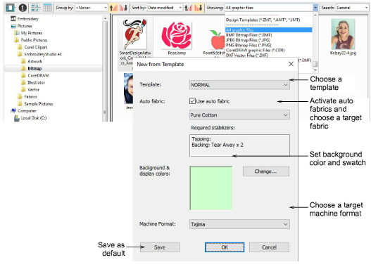
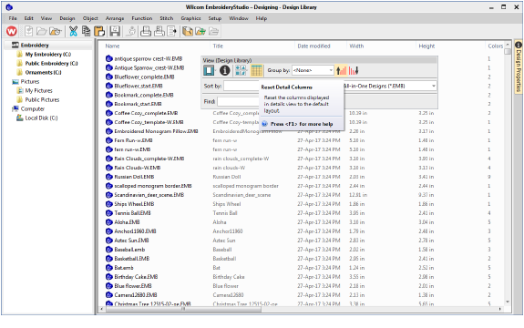
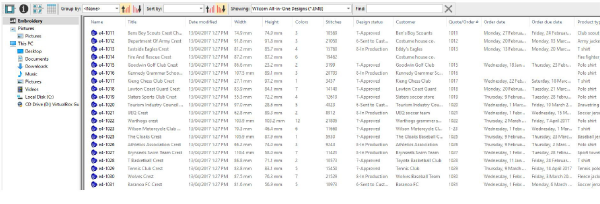
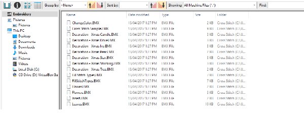
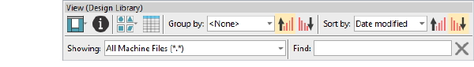
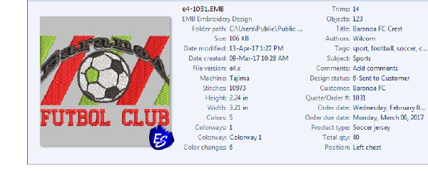

# Design Library improvements

The ES e4 Update 1 enhances Design Library functionality and corrects a number of problems.

## New from selected template in Design Library

|  | Use Manage Designs > New From Selected to create new designs based on designs selected in the embroidery library. |
| -------------------------------------------------- | ----------------------------------------------------------------------------------------------------------------- |

You can now specify which EMB template to use in Design Library. Select a graphic file and right-click the New from Selected button. This allows you to choose which EMB template to use for the new design you will create from the selected graphic. This template selection is remembered during the current session and used the next time the command is invoked. Left-clicking uses the default selection. [See also Opening designs from Design Library.](../../Management/manage_designs/Opening_designs_from_Design_Library)

## New Reset Detail Columns button

|  | Use View > Reset Detail Columns to reset the columns displayed in details view to the default layout. |
| ------------------------------------------------------ | ----------------------------------------------------------------------------------------------------- |

Design Library provides a new Reset Detail Columns button on the View toolbar:

When viewing design lists in Details view, columns can be customized in any order and with a variety of criteria. To return to the default layout, simply click the new Reset Detail Columns button. [See also View design details.](../../Management/manage_designs/View_design_details)

Note that default fields vary by file type and are controlled by Windows. Design Library columns for embroidery files are controlled by ES e4\. These are primarily intended for EMB format but can be useful for other embroidery formats as well. They include such details as design status, customer, order date, etc.

Sometimes Windows resets detail columns to Windows defaults, even for EMB files:

If this happens, use the Reset Detail Columns button to reset detail columns to ES e4 defaults. Do this for other embroidery formats as necessary.

## Design Library refresh

Like Windows Explorer, the Design Library display can be refreshed with a simple F5 keypress.

## Pressing backspace in search

Previously, holding the Backspace key to clear a search would jump to the cursor to the beginning of the field without deleting the text. This problem has been rectified.

## Searching for non-native files

Searching for machine files did not always yield correct results. Problems were also reported when searching for ART and T0? files. A related issue has been the mismatching status of the Showing field. These problems have been rectified.

## Order information

A problem occurred with missing order information in the Details pane. This has been rectified.

## Browsing the network for large files

Problems were reported with abnormal loading when browsing through network folders containing large files. This has been rectified.

## Design Library reliability

Occasional Design Library crashes were reported while carrying out some operations such as:

- Editing properties in the Design Properties docker. For instance, updating design status in the Details pane and/or Design Properties pane and then saving.
- The Preview pane can cause the software to crash when selecting a design file while thumbnails are being generated.
- Also reported – application crashes when moving images from one folder to another.

All these problems have been rectified.
