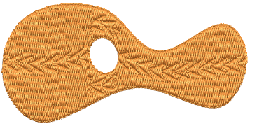
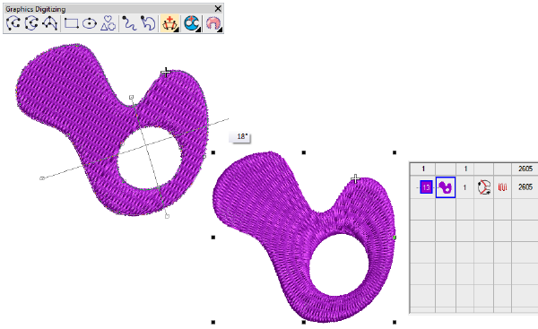

# Digitizing improvements

The ES e4 Update 1 enhances and corrects a number of digitizing problems.

## Flexi-split with complex fill objects

|  | Use Stitch Effects > Flexi Split to create decorative split patterns following stitch angles and scaled according to object width. Right-click for settings. |
| ---------------------------------------- | ------------------------------------------------------------------------------------------------------------------------------------------------------------ |

Currently flexi-split effect is used mainly with satin stitch. It could always be applied to tatami Input A objects. It can now be applied to tatami complex fill objects. [See also Flexi-splits.](../../Decorative/curves/Flexi-splits)

Note: Flexi-split is applied to each ‘segment’ of a complex fill as shown above.

## Stitch angles

|  | Use Graphics Digitizing > Stitch Angles to add stitch angles to selected objects. |
| -------------------------------------------- | --------------------------------------------------------------------------------- |

When creating or selecting complex fill objects with holes, the Stitch Angles tool is now enabled in ES Decorating. Also, the addition of stitch angles to closed shapes now results in complex turning objects (rather than A/B). [See also Adjusting stitch angles.](../../Quality/quality/Adjusting_stitch_angles)

