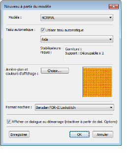

# LOTE improvements

The ES e4 Update 1 enhances and corrects a number of LOTE issues.

## Truncation problems

Truncation problems in some dialogs have been reported in languages other than English. These have been rectified.

## Pique polo in Spanish interface

In Spanish language, the fabric type ‘pique’ was missing from the auto-fabric settings. It now appears translated as ‘lucio’.

## Application crashes when saving user-refined letters

There have been reports of application crashes when saving a user-refined letter in German or French interfaces. This issue has been rectified.
