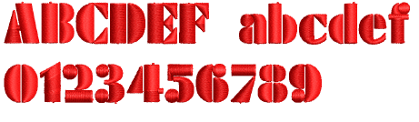
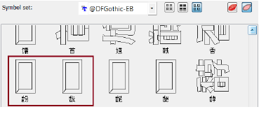

# Lettering improvements

The ES e4 Update 1 enhances Lettering functionality and corrects a number of problems.

## Zigzag with lettering

Previously, users were unable to apply zigzag stitching to selected lettering via the Stitches toolbar. Zigzag was disabled and could not be selected. This problem has been rectified. [See also Applying stitch types & effects to lettering.](../../Lettering/lettering_advanced/Applying_stitch_types_effects_to_lettering)

## Embroidery fonts

The 3D Futuro embroidery font has been improved and repackaged.

Recommended letter heights for 3D and some other fonts have been reviewed and the user manual updated accordingly. [See Standard Fonts for details.](../../Management/sample_fonts/Standard_Fonts)

## Character display

Characters were replaced by a \~ character in the Lettering field when not appearing in the font. Selecting another font caused the lettering object to be completely removed. This problem has been rectified.

In the Insert Symbol dialog, non-existent characters are now displayed as squares and used when inserted into a design. A ‘fallback character’ is displayed below the blank placeholder character.

Tip: If you want to check whether a character exists in a font, copy the fallback character and paste it into an MS Word document. Then try changing fonts until you find one that includes the character.

## Lettering Kiosk

Some related issues were causing problems when the Kiosk lock setting is activated in the Options dialog:

- Toolbars are unavailable via the Window > Toolbars menu.
- Opening designs from Design Library invokes the Kiosk instead of the Wilcom Workspace screen.
- Some Kiosk controls appear in the Wilcom Workspace window immediately after exiting the Kiosk mode.

All these problems have been rectified.
