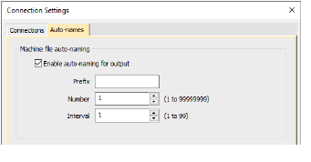
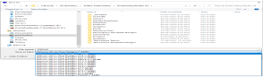

# Output improvements

The ES e4 Update 1 enhances and corrects a number of issues to do with outputting designs.

## Automatic machine file naming

Connection Manager now provides an option for automatic machine file naming. When enabled, the specified filename format is used for all machine connections established in Connection Manager. [See also Setting up machines for Connection Manager.](../../Setup/hardware/Setting_up_machines_for_Connection_Manager)

Where...

| Setting         | Details                                                                                                              |
| --------------- | -------------------------------------------------------------------------------------------------------------------- |
| Filename format | Filenames take the format &lt;prefix&gt;&lt;number&gt;.&lt;extension&gt;                                             |
| Prefix          | ASCII only, no unicode characters. No Windows reserved characters. Length limit 8 characters.                        |
| Number          | Numeric only. Range 1 – 99,999,999.                                                                                  |
| Interval        | Interval is numeric only and is the amount the number is incremented each time a file is generated. Range is 1 – 99. |

::: info Note
When enabled, Kiosk also uses this auto-name specification for all machine files. If not enabled, it uses the kiosk machine file definition.
:::

## PDF printing

A number of problems were reported in relation to PDF printing from the Print Preview window.

- The Print Preview > Print to PDF command ignores the Portrait / Landscape setting. It always creates a portrait display.
- The software reports an error attempting to read the license for the NovaPDF software after a Windows 10 update.
- Similarly, a NovaPDF license error is sometimes reported after starting up the software.

All these problems have been rectified.

## Hatch e3.6 file format

The latest release allows ES e4 to read and write Hatch EMB e3.6 file format. The standard list of supported formats now includes:

