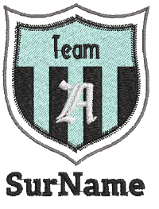

# System improvements

The ES e4 Update 1 provides a number of general system improvements.

## Icons in the Object Properties docker

Incorrect icons have appeared in the Object Properties docker when not all options are enabled. This problem has been rectified.

## Color changes with Colorway Editor docker

Problems have occurred when clicking a color in the Colorways list of the Colorway Editor docker. Any selected object’s color incorrectly changes. This problem has been rectified.

## Generic Write Error

‘Generic Write Errors’ have been reported when saving designs incorporating images imported via CorelDRAW Graphics. This problem has been rectified.

## CorelDRAW in ES dockers

Problems have been reported with CorelDRAW ‘artefacts’ persisting in Wilcom Workspace dockers. These have been rectified.

## Using high-end Wacom tablets

With the initial release of ES e4, the user had to do an extra swipe to obtain a right-click action on high-end Wacom tablets. For example, when creating curve points with a digitizing tool. This problem has been rectified. Input behavior is as it was in ES e3.

## Application crashes with packaged teamname sample designs

When Team Names Advanced is unavailable, there have been reports of application crashes when opening packaged teamname samples. This problem has been rectified.

## Failure to create empty document

When a complex fill object is created and the design saved – EMB or machine file format – a ‘Failed to create empty document’ is displayed when attempting to create a new design. Also most of the UI is grayed out and the software unusable until restarted. This has been rectified.

## Communications with the Happy Voyager machine

Problems have been reported when downloading design files to the Happy Voyager machine via Machine Manager. A serial error is shown on the machine panel. This problem has been rectified.

## Internal Envelope Error

An Internal Envelope Error has been reported in relation to system security. This problem has been rectified.
