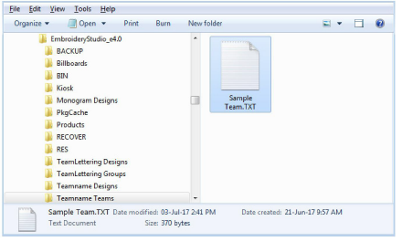

# Team Name improvements

The ES e4 Update 1 enhances Team Names functionality and corrects a number of problems.

## Importing teamname lists with additional fields

|  | Use Toolbox or Docker > Team Names to associate multiple names with a design. |
| -------------------------------------- | ----------------------------------------------------------------------------- |

A ‘size’ field is often added to teamname lists even though it does not form part of the design. Previously, additional fields were stripped on import. They are now included. While the size field doesn’t appear in the design, it is added to each design name when generated. This allows machinists to ensure they are using the right size garment for the specified name. [See also Creating simple teamname designs.](../../Lettering/lettering_names/Creating_simple_teamname_designs)

To view size fields in the Manage Teams dialog, first save the teamname file in CSV or TXT format to the Teamname Teams system folder as shown. Don’t use sub-folders.

Open the Manage Teams dialog and select the file name from the Teams droplist. All fields will be imported...

## Adding columns to the members list

There used to be a 10 column limit on the number of team members you could add. You can now add a virtually unlimited number of columns. Note, however, that only the first 100 will be saved.

## Manage Teams button

|  | Use Team Names > Manage Teams to manage teams and team members for future use. |
| ------------------------------------------ | ------------------------------------------------------------------------------ |

The Manage Teams button should not be selected by default immediately after the Team Names docker is opened. This problem has been rectified. [See also Managing teams.](../../Lettering/lettering_names/Managing_teams)

## File export for team names

The file export dialog for team names now displays correctly.

When saving a teamname design with ‘Repeated design and team names with Stops’ selected, the design gets shifted in the output files. This problem has been rectified.

## Adding lettering art to team names

You can add lettering art to teamname objects from lettering properties accessed via the Team Names docker. Circumstances have been reported where lettering art is applied but then lost. This problem has been rectified when switching between two team names. There may be other circumstances, however, that have not been identified or addressed.

## Teamname letter spacing

Teamname letter spacing issues were reported in cases where a design contains very long names or different numbers of names.

The solution is to edit the baseline to make more space available, or change the method of size reduction in lettering properties:

Adjust baseline settings for ‘fit text’ either using ‘Spacing and Width’ or ‘Spacing and Size’:

