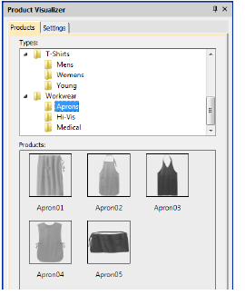

# Usability improvements

The ES e4 Update 1 enhances and corrects a number of usability functions.

## Color palette scrolling

In instances where the color palette is full, you need to click the spin box to scroll through the available colors. Previously, the palette reverted to first position when you start digitizing. It now remains at the current color slot. This allows you to easily select nearby colors.

::: tip
You can always float the color palette to display the full range of colors (max 128). This is more practical when using a high resolution (4K) monitor or second monitor.
:::

## Product registration

There have been requests to include a Product Registration option in the Help menu. This has now been added to allow users to both register their product and/or check its current status. If already registered, it will display your current serial number and dongle tag number. If not registered, it will walk you through the process.

## Scrolling through items in Product Visualizer

The mouse scroll-wheel now works correctly and faster when scrolling through the product listing.

