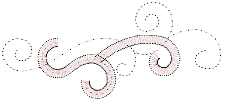
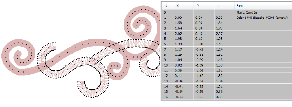

# Cording

|                            | Use Traditional Digitizing > Digitize Run to create row of single stitches along a digitized line.    |
| ---------------------------------------------------- | ----------------------------------------------------------------------------------------------------- |
|                    | Use Effects > Cording to add cord to objects with run, tatami, contour, spiral, or stipple stitching. |
|  | Click View > Show Needle Points to show or hide the needle points in embroidery stitching.            |

Cording refers to the technique of fixing a thick cord or yarn onto a fabric, usually for decorative purposes. Digitizers frequently want to see the cord line so that while they digitize, they don’t overstitch on sharp turns. The new Cording function allows you to designate the outline stitching which is to form the cording.

The Cording effect can be applied to Run stitch objects. The cord is displayed as a graphic line. It takes the color of the outline stitching. This allows designers to check technical correctness and better visualize a corded design look.

When Cording is applied, a Cord In/Out function is inserted into the stitch sequence. Some machines have a specific cording function which is output when saving to machine file – e.g. Barudan FDR-3 file format or Schiffli machines that support cording. [See also Cording.](../../Applied/mixed/Cording)
