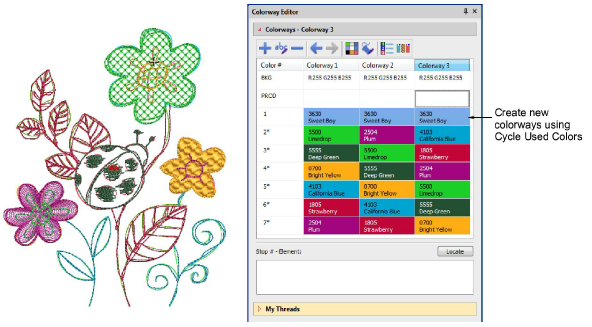

# Create new colorways with the color wheel

|  | Use Color toolbar > Cycle Used Colors to cycle through combinations of used colors. Right- or left-click. |
| -------------------------------------------------- | --------------------------------------------------------------------------------------------------------- |

ES e4.1 allows you to create new colorways using the Cycle Used Colors method. Simply create a new colorway in the Colorway Editor and cycle through existing colors to find a color scheme you like. [See also Creating colorways.](../../Digitizing/colorways/Creating_colorways)

