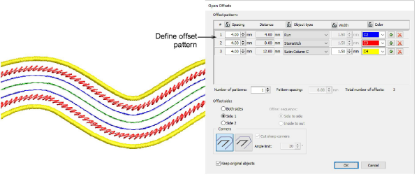
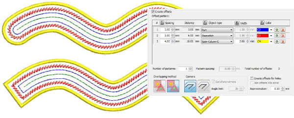

# Create offsets with open objects

|  | Use Toolbox > Open Offsets to create accurate offsets for any open embroidery or vector object.  |
| -------------------------------------------------- | ------------------------------------------------------------------------------------------------ |
|  | Use Toolbox > Outlines & Offsets to create closed offsets for open embroidery or vector objects. |

The Open Offsets tool allows you to generate parallel offsets from any open shape. Offset lines are calculated at a specified distance for a specified number, one side or other side, or both sides.

You can now use the Outlines & Offsets tool with open objects to create closed offsets as shown. Select rounded or squared corners as preferred. The squared option allows you to adjust the angle limit – first select Cut Sharp Corners and set required angle value. [See also Generating outlines & offsets.](../../Modifying/productivity/Generating_outlines_offsets)

