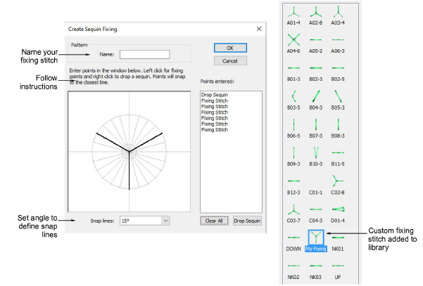
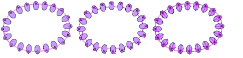

# Custom sequin fixings

There is now a capability to define custom fixing stitches to support multi-head sequin devices. Some limitations might exist for older more complicated sequin devices. Access the dialog via the Object menu. [See also Custom sequins.](../../Applied/sequin_advanced/Custom_sequins)

Benefits of user-defined sequin fixings include:

- Create multiple layers of stitching for decorative effects, sometimes in different thread colors (Barudan).
- Reduce stitch counts in large sequin designs.
- Accommodate specific fixing requirements.
- Accommodate new capabilities – e.g. offset holes.

Tip: If you have chosen an eccentric sequin type such as ‘ellipse’, fixing stitches automatically adapt to fit.

