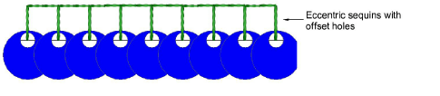

# Custom sequin shapes & hole positions

ES e4.1 now supports sequin shapes with offset holes. Such sequin shapes can be utilized for flipping sequins on the fabric to form two different sequin fill patterns. [See also Custom sequins.](../../Applied/sequin_advanced/Custom_sequins)

The software allows you to define your own shapes with their own hole position and size. Overlap allowance is automatically adjusted to accommodate different hole positions.

