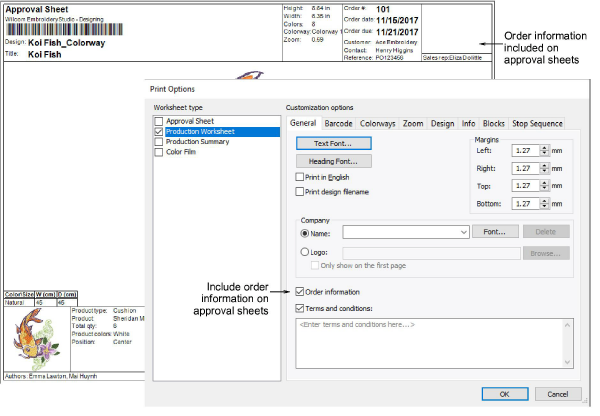

# Customize order information on approval sheets

With the ES e4.1 release, you can better customize the approval sheet options. Customer information is now included with order information. Terms and conditions can be excluded, as preferred. [See also Customizing design reports.](../../Production/reports/Customizing_design_reports)

