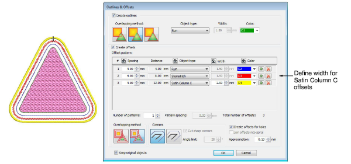

# Define Column C width in offset objects

|  | Use Toolbox > Outlines & Offsets to create outlines and offsets of any type for any filled embroidery or closed vector object. |
| ------------------------------------------------------------ | ------------------------------------------------------------------------------------------------------------------------------ |

The Outlines & Offsets tool now includes a Width setting to define Column C width when creating Satin Column C offsets. [See also Create outlines & offsets.](../../Modifying/productivity/Create_outlines_offsets)

