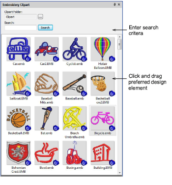

# Drag-and-drop EMB designs from the new clipart docker

|  | Use Docker > Embroidery Clipart to toggle the docker display. Use it to record and recover re-usable embroidery elements. |
| ------------------------------------------------------ | ------------------------------------------------------------------------------------------------------------------------- |

With the ES e4.1 release, the Embroidery Clipart feature has been reinstated, albeit in a modified form. Embroidery Clipart is a powerful productivity tool which allows you to recycle commonly used elements. When you install EmbroideryStudio, the Embroidery Clipart feature is installed with the Design Library together with a sample clipart library. The feature uses standard EMB designs in folders, not EMC designs from a database as used in ES e3\. It is available with ES Designing and ES Digitizing only.

Use Design Library to manage design elements in your clipart folders. Use Design Properties to assign names and keywords to each design element you save. Keywords play an important part in organizing a growing clipart library. Finding a suitable element can take time but keywords narrow the selection. Any number of keywords can be assigned to the same clipart element. [See also Viewing & managing design information.](../../Management/manage_designs/Viewing_managing_design_information)

::: info Note
The current Embroidery Clipart implementation allows you to access your old clipart designs. Simply browse to the ‘C:\\WilcomClipArt\\Designs’ folder. You can even add this folder to Design Library. Note, however, that keywords entered into the old database are not included in the clipart files and are not searchable in the new docker.
:::
