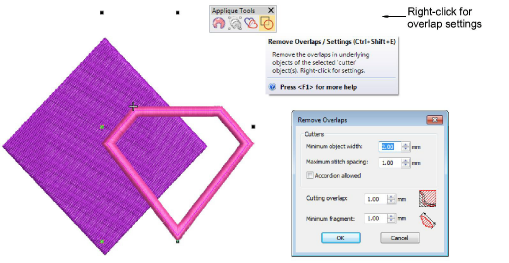

# Easy access to Remove Overlaps settings

|  | Use Appliqué > Remove Overlaps to remove underlying layer of stitching in overlapping objects using the selected object as a ‘cutter’. Right-click for settings. |
| ------------------------------------------------ | ---------------------------------------------------------------------------------------------------------------------------------------------------------------- |

Right-click of the Remove Overlaps tool will display the overlap settings dialog. A shortcut key, Ctrl+Shift+E, has been added for quick overlaps removal. [See also Removing underlying stitching.](../../Quality/quality/Removing_underlying_stitching)

