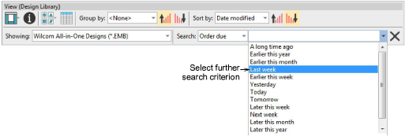

# Faster and more precise design searches

Design Library allows for even faster searching of designs. Use the View toolbar to quickly search or sort designs by name, create date, and other criteria. The improved Search field is very powerful. To begin with, select a file type to search on, and select criteria from the improved droplists.

Searchable fields include common commercial categories:

- Name
- Title
- Date modified
- Order #
- Order date
- Order due date
- Order notes
- Customer
- Contact
- Reference
- Sales rep
- Design status

Once you have selected a search criteria – e.g. ‘Order due’ – select further criteria from the second droplist. [See also Locating designs in the library.](../../Management/manage_designs/Locating_designs_in_the_library)

