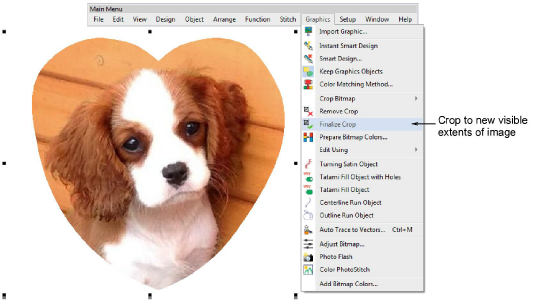

# Finalize crop command

When you create a cropped area, it is considered ‘temporary’ and can be reshaped at will. The new Finalize Crop command turns a ‘virtual crop’ into a ‘hard crop’ by reducing an image to its new visible extents. The only way to go back is via the Undo command or by reinserting the original bitmap. [See also Crop bitmap images.](../../Automatic/bitmaps/Crop_bitmap_images)

