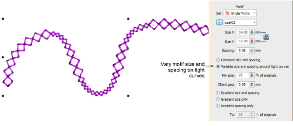

# Graded motif size & spacing in motif runs

|            | Use Outline Stitch Types > Motif Run to create a string of motifs along a digitized line. |
| ---------------------------------------------- | ----------------------------------------------------------------------------------------- |
|  | Use Outline Tools > Motif Run to place a row of motifs along a digitized line.            |

Part of the new Advanced Motifs Element, size and spacing settings allow you to automatically grade motif size and spacing in motif runs from a specified starting size to finishing size. [See also Motif runs.](../../Decorative/motifs/Motif_runs)

Options include:

- Grade motif size proportionally or maintain constant size.
- Grade motif spacing proportionally or maintain constant spacing.
- Vary motif size and spacing on tight curves. This option automatically reduces motif size and spacing in proportion to the sharpness of the curve, similar to variable run stitch length. Also similar, the ‘chord length’ setting controls how closely motifs follow the curve.

A new checkbox, ‘Re-generate motif run after transformation’, forces the system to re-generate motif runs based on current settings whenever an object is scaled or skewed. When left unchecked, the system will not re-generate and the number of motifs will remain unchanged after the transformation. [See also Reshape motif runs.](../../Decorative/motifs/Reshape_motif_runs)

