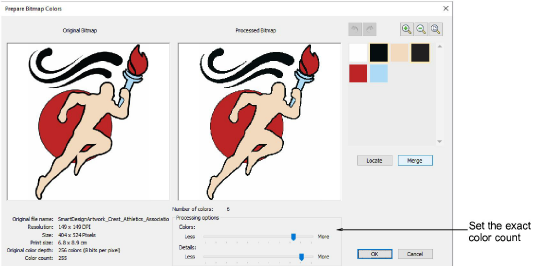

# Improved color reduction for logo type artwork

|  | Use Auto-Digitizing Tools > Prepare Bitmap Colors to reduce the number of colors and remove image ‘noise’ in non-outlined images. |
| ------------------------------------------------------ | --------------------------------------------------------------------------------------------------------------------------------- |

Color reduction has been improved for auto-digitizing logo type artwork with the aim of providing more accurate shapes for stitching. A new color-reduction method for logo style designs produces more reliable and predictable color reduction in ‘solid color’ designs. Unwanted edge artifacts are avoided with more complete removal of anti-aliasing effects. There have also been improvements in the treatment of gradient colors, including an option to remove/replace all gradients with solid colors. [See also Preparing images for auto-digitizing.](../../Automatic/bitmaps/Preparing_images_for_auto-digitizing)

