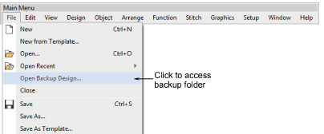

# Improved error handling of EMB files

Error handling and backup of EMB files has been improved with the latest ES e4.1 release. During the writing of EMB files, the software will now preserve the original file until it has successfully written the new file. If an error occurs while writing the new design file, the original file is restored. A new File > Open Backup Design command allows you to find your backup folder. [See also Automatic save & backup options.](../../Setup/settings/Automatic_save_backup_options)

